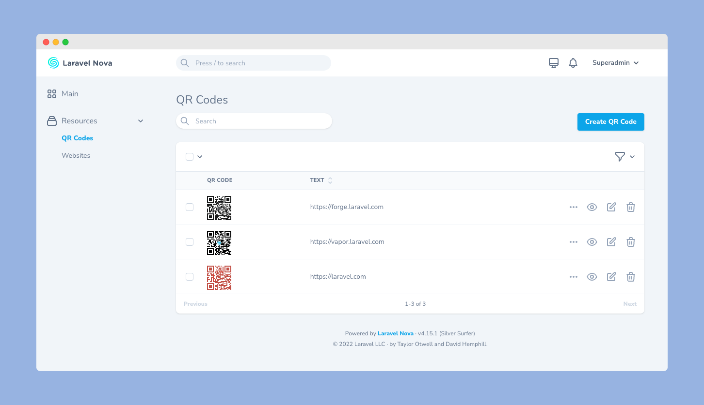

# Nova QR Code Manager

A Laravel Nova tool to manage QR code. Behind the scenes, [devtical/nova-qrcode-field](https://github.com/devtical/nova-qrcode-field) is used.



## Installation

You can install the Nova tool in to a [Laravel](http://laravel.com) app that uses [Nova](http://nova.laravel.com) via composer :

```cli
composer require devtical/nova-qrcode-manager
```

Publish the migration with :

```cli
php artisan vendor:publish --tag=qrcode-manager-migrations
php artisan migrate
```

## Usage

Add `QrcodeManager` to your `NovaServiceProvider.php`

```php
use Devtical\QrcodeManager\QrcodeManager;

// ...

public function tools()
{
    return [
        // ...
    	new QrcodeManager(),
    ];
}
```

## License

The MIT License (MIT).
